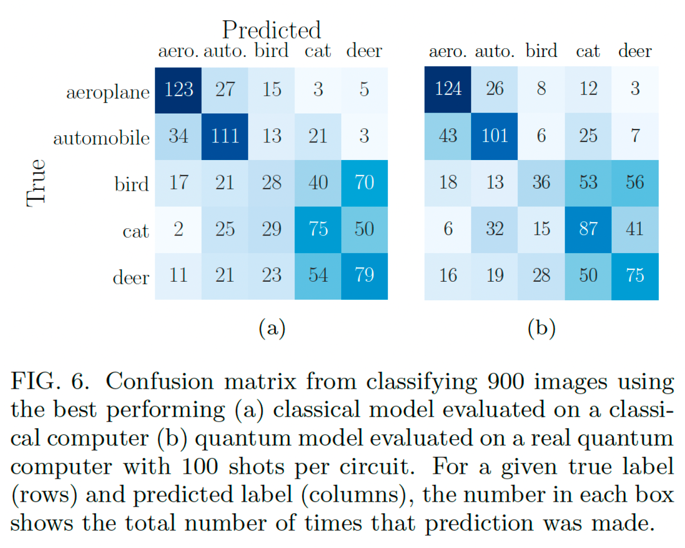

# Analysis of Quantum Circuits for Classification Tasks

The repo represents the master thesis work of Prasham Bhuta, under supervision of Dr. Linas Petkevicius, as part of Mathematics & Informatics Faculty, Vilnius University graduate program, January 2024.

## Structure

* The learning and segments of experimental code can be found in [notebooks/learn](notebooks/learn/).
* The notebooks used for experiments, and analysis are located in [notebooks/experiments](notebooks/experiments/).
* The thesis is located in [thesis](thesis/) folder, and can be accessed directly [here](thesis/Master%20thesis%20P.Bhuta.pdf)
* A short presentation can be found in [presentation](presentation/) folder and [here](presentation/master_thesis_PBhuta.pdf)

## Goal 

To describe and showcase quantum algorithms, and compare with classical machine
learning methods by setting a classification task under a similar construct.
* Objectives
    1. Systematic exploration of the development and the underlying principles governing
quantum circuits.
    2. Showcase the use of current technologies to initialize and train quantum architecture.
    3. Investigation on quantum performance with varying quantum circuits, and problem
complexities.
    4. Classification with quantum circuits, and compare performance with classical
methods.

Quantum Circuits vs Classical Methods

|Quantum Circuits |Classical Methods|
|------------- |-----------|
|Quantum Support Vector Classifier (QSVC) |Support Vector Machine Classifier|
|Variational Quantum Classifier (VQC) |Light Gradient Boost Machine|
||Quadratic Discriminant Analysis|
||Random Forest Classifier|
||K Neighbors Classifier|

## Dataset

The following images and table tries to provide an understanding of the data.

|X1|X2|X3|...|Y1|Y2|...|YT|
|--|--|--|---|--|--|---|--|
|12|8|6|...|1|0|...|22|
|6|4|3|...|1|1|...|17|
|16|3|5|...|0|0|...|8|

## Approach

The approaches involve varying the degree of complexities for the tasks, and to observe and track the performance changes. The tables represent the approaches.

_Approach 1_

|Parameters | Values|
|--------- | ----|
|No of samples | 1024|
|No of features (Xi) | [2,4,8,12,16]|
|No of classes  | 3|
|No of labels | 3|
|No of quantum feature map reps | [2,3,4,5,6,8,12]|
|No of quantum ansatz reps | [2,3,4,5,6,8,12] |

_Approach 2_

|Parameters | Values|
|--------- | ----|
|No of samples | 1024|
|No of features (Xi) | [2,4,8,12,16]|
|No of classes  | [3,4,5,6,8,12]|
|No of labels | [3,4,5,6,8,12]|
|No of quantum feature map reps | 3|
|No of quantum ansatz reps | 3 |

## Results

The graphs and table show the results of the study.

_F1 score with varying number of features_

_F1 score with varying number of classes_

_Time in logarithmic seconds of models for varying number of features_

_Performance of Variational Quantum Classifier (VQC) model with varying number of feature map and ansatz repetitions_

A summary of results is:

1. The best-performing models for varying numbers of input features (M) are Random
forest (for a lower number of features), and QSVC (for a higher number of features).
2. The performance of the quantum QSVC model for varying numbers of classes is
comparable to the top-performing (Light Gradient Boost Machine) model.
3. The quantum model training time on the quantum-classical simulator for the number
of input features (M) for QVC, and QSVC increases exponentially with an increase in
complexity.
4. The performance, F1 score, for QVC with varying numbers of feature map and
ansatz repetitions doesn’t show improvement.

## Conclusions

1. Quantum support vector classifier (QSVC) based on a linear kernel outperforms the
classical machine learning classifiers.
2. The performance of the quantum SVC classifier drops by a small margin with
increasing the number of classes, this is in contrast with the good classical models
whose performance remains stable.
3. Increasing the complexity of the quantum circuit algorithms, exponentially increases
computation time on the quantum-classical simulator, but importantly on a
quantum-classical simulator.
4. Varying the number of feature map repetitions, or ansatz repetitions to vary the
variational quantum classifier (QVC) complexity does not lead to improved
performance of the classifier.
5. The performance, F1 score, & training time of quantum models would change if the
experiments were repeated on a physical quantum computer.

## Future Scope

_Possible extension in current study_

* Use of different methods of entanglement, such as ’linear’, ’rotational’,
’reverse-linear’, and others to check for performance.
* Checking for performance on real quantum systems, especially the time complexity
task.
* Experiment with the same approach but a different quantum technology platform,
and compare performances.

_In the field of quantum study_

* Construction of complex architecture such as Quantum Convolutional Neural Nets
(QCNN), Quantum Autoencoders will widen the scope of machine learning tasks with
quantum computers.
* Since limited scope to perform multi-class, multi-label classification, construction of
circuits that facilitate that.

## Related works

In the study by Jaderber et al, the researchers conducted
training with the first five classes of
CIFAR-10 and implemented a projection head. They explored three distinct
representation networks: a classical MLP
with bias and Leaky ReLU activation functions,
a quantum network trained on a state
vector simulator, and a quantum network
trained on a sampling-based simulator. In their study, the highest accuracy is obtained
at the end of training, where the quantum
model achieves an accuracy of (46:51 ±
1:37)% compared to (43:49 ± 1:31)% for the
classical model.

## Key References
* Kerstin Beer. Quantum neural networks. 2022.
* Jacob Biamonte, Peter Wittek, Nicola Pancotti, Patrick Rebentrost, Nathan Wiebe, and
Seth Lloyd. Quantum machine learning. Nature, 549(7671):195–202, September 2017.

* M. Cerezo, Andrew Arrasmith, Ryan Babbush, Simon C. Benjamin, Suguru Endo, Keisuke
Fujii, Jarrod R. McClean, Kosuke Mitarai, Xiao Yuan, Lukasz Cincio, and Patrick J. Coles.
Variational quantum algorithms. Nature Reviews Physics, 3(9):625–644, August 2021.

* Qiskit ecosystem. Quantum kernels: https://qiskit.org/ecosystem/machinelearning/
tutorials/03_quantum_kernel.html, 2023.

* Siddhant Garg and Goutham Ramakrishnan. Advances in quantum deep learning: An
overview, 2020.

* Vojtěch Havlíček, Antonio D. Córcoles, Kristan Temme, Aram W. Harrow, Abhinav
Kandala, Jerry M. Chow, and Jay M. Gambetta. Supervised learning with quantumenhanced
feature spaces. Nature, 567(7747):209–212, March 2019.

* Maria Schuld, Alex Bocharov, Krysta M. Svore, and Nathan Wiebe. Circuit-centric
quantum classifiers. Phys. Rev. A, 101:032308, Mar 2020.

* Maria Schuld and Nathan Killoran. Quantum machine learning in feature hilbert spaces.
Physical Review Letters, 122(4), February 2019.

* Guillaume Verdon, Michael Broughton, Jarrod R. McClean, Kevin J. Sung, Ryan Babbush,
Zhang Jiang, Hartmut Neven, and Masoud Mohseni. Learning to learn with quantum
neural networks via classical neural networks, 2019.
